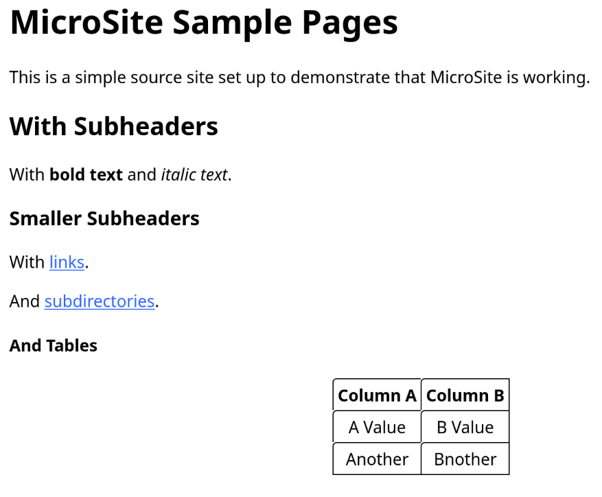

# microsite

Tools for building a small web.


## Usage

MicroSite is a tool of simplicity. Use it to reduce the difficulty of publishing static content on the web.


**Build Your Content with Markdown**

Use simple [Markdown](https://daringfireball.net/projects/markdown/syntax) syntax to create your content in a separate directory. See our [sample site](sample-site/) for some examples.


**Render the Content into HTML**

Use MicroSite's command line tool to convert your Markdown into HTML.

```
> python -m microsite sample-project.toml render
Logging configured.
Creating target directory sample-output/
Rendering sample-site/page2.md to sample-output/page2.html
Rewriting URLs in links...
Rendering sample-site/index.md to sample-output/index.html
Rewriting URLs in links...
Rendering sample-site/dir/page3.md to sample-output/dir/page3.html
Rewriting URLs in links...
Copying unrendered file microsite.svg
```

Verify the output in your web browser:

```
firefox sample-output/index.html
```




**Publish to an S3-backed website**

[Configure your AWS credentials](https://docs.aws.amazon.com/cli/latest/userguide/cli-configure-files.html) and either build a private S3 bucket for storing a status file or get a Pulumi Cloud API token. Configure a publish engine and go live!

```
> python -m microsite sample-project.toml publish
Logging configured.
Ensuring the working directory /home/ryan/workspace/ryanjjung/microsite/tbpulumi-s3website-prod exists.
Publishing using Pulumi
Deploying the site. See pulumi.log for progress, pulumi.err for errors.
Deleting working directory /home/ryan/workspace/ryanjjung/microsite/tbpulumi-s3website-prod
```


**Your site is [now live](http://microsite-sample-site.s3-website-us-east-1.amazonaws.com)!**


**Take your site offline**

```
> python -m microsite sample-project.toml publish -x
Logging configured.
Ensuring the working directory /home/ryan/workspace/ryanjjung/microsite/tbpulumi-s3website-prod exists.
Publishing using Pulumi
Destroying the site. See pulumi.log for progress, pulumi.err for errors.
Deleting working directory /home/ryan/workspace/ryanjjung/microsite/tbpulumi-s3website-prod
```